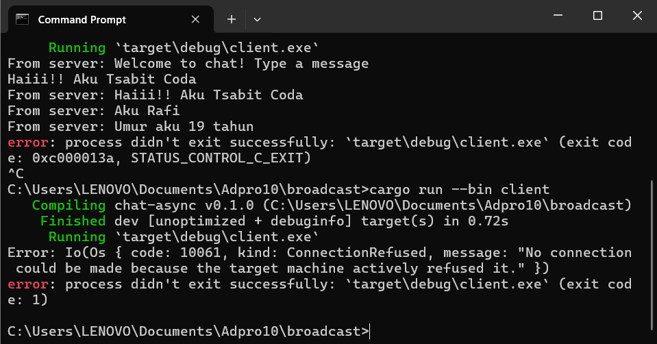
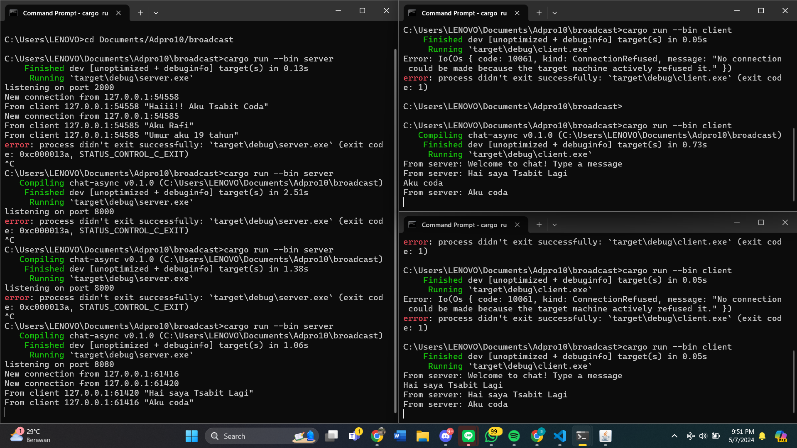
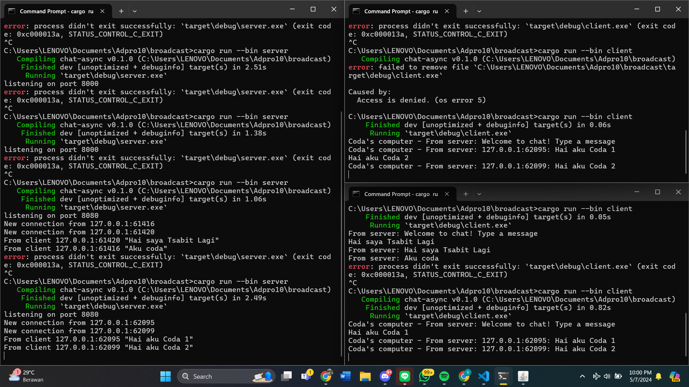

Menjalankan `cargo run --bin client` command untuk client dan `cargo run --bin server` command untuk server.

Ketika client mengirimkan pesan pada server, server akan langsung mengirimkan pada semua client.

Jika server client diubah, maka program secara otomatis akan menolak (foto 1) dikarenakan port disini seperti sebuah jalan yang dapat menghubungkan keduanya (foto 2).

Dengan penggunaan `bcast_tx.send(format!("{:?}: {}", addr, text))?;` pada server side, maka server memungkinkan untuk melihat alamat client yang memberikan message.

