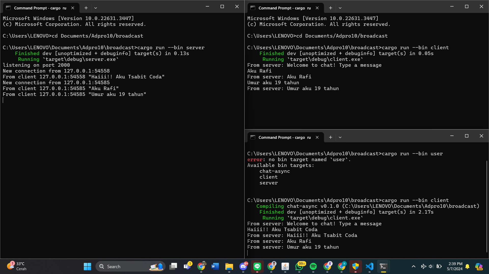

Menjalankan `cargo run --bin client` command untuk client dan `cargo run --bin server` command untuk server.

Ketika client mengirimkan pesan pada server, server akan langsung mengirimkan pada semua client.